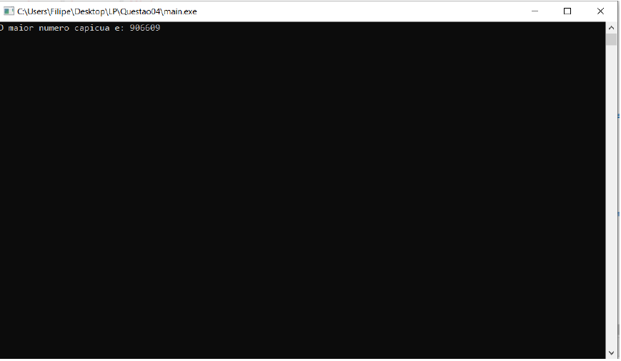

# Número Capicua
### Número capicua resultante do produto entre dois números de três dígitos
Trabalho desenvolvido para cimentar os conhecimentos adquiridos nas cadeiras de Linguagens de Programação e Algoritmos e Estruturas de Dados.

**O objetivo da aplicação consiste em encontrar o maior número capicua resultante do produto entre dois números de três dígitos.**

Se quiser utilizar o programa basta:
* Executar o ficheiro denominado "main.exe".

Aqui tem um exemplo do programa em execução:

